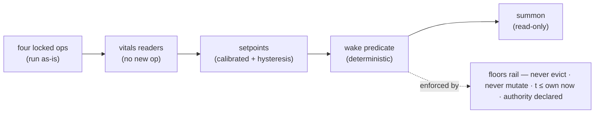
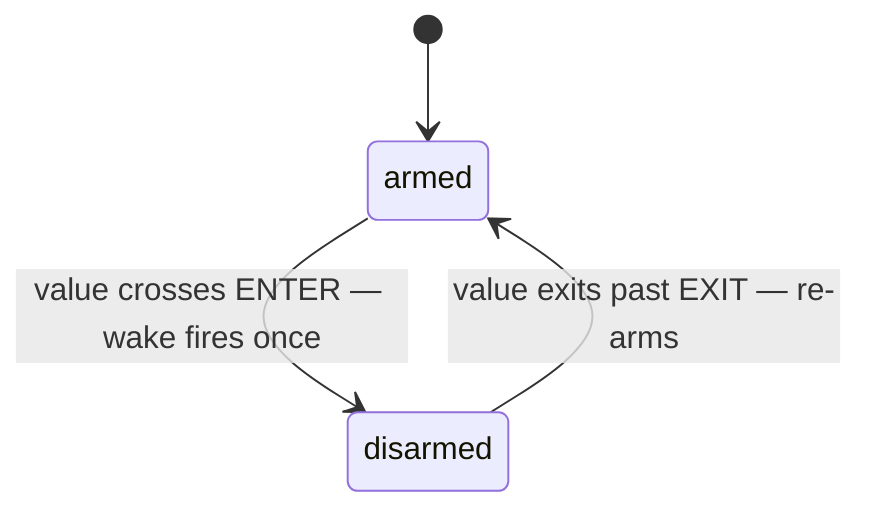

# SALUS — operator README


**A smoke detector for a mind's condition.**

Four gauges read from ops that already run. When one crosses its
calibrated band, SALUS wakes a matched class of memories.

**Read-only. Deterministic. Replayable.**

Thesis: **Condition Wakes Memory** — the state is *measured, not reported*.

---

## The coffee-shop version

Okay — you know that moment. You're deep in something, and your brain
quietly goes *"hold on… why am I reading this?"* — and then, without
you asking, it hands you exactly what you needed: the goal, the plan,
the reason you sat down.

Your brain did that off a **feeling**. Not a search. Nobody typed a
query.

**That's SALUS.** Every memory system out there waits for a question,
then matches words to words. SALUS never waits for a question. It sits
next to a mind — an AI agent's, for now — and watches its vitals, the
way a nurse watches monitors:

- how **scattered** its attention is getting
- how **stale** its beliefs are going
- how much unfiled work is **piling up**

Not interfering. Just watching.

The moment a vital crosses the line it learned during calm — *ping* —
the right memories surface on their own. Attention scattering? Here's
your goal again. That's the whole trick: **the condition does the
retrieving.**

House rules: it can only *read*, never touch. It **proves** after
every wake that nothing changed. And it can't spam — one nudge, then
it waits.

All of it deterministic to the byte — every wake replays identically,
so you can scrub yesterday like footage.

---

## Is it healthy? One command

From the repo root (system Python ≥ 3.13, zero dependencies):

```
python verify\success_signature.py
```

**Healthy =** five YES lines ending `5/5 — v1 SHIPPED`.

Anything else → the failing line *names the broken property*.

```
SALUS v0.2.1 — success signature — mission: clip_two
  [1] dormant while entropy low ............. YES
  [2] wake fires on the crossing ............ YES
  [3] identical replay, run twice ........... YES
  [4] no floor breached ..................... YES
  [5] wake event visible as data ............ YES
  5/5 — v1 SHIPPED
```

---

## The path — one glance



**Why the wake never flaps** — each band is a two-state machine.
It fires *exactly once* per crossing episode:



---

## All commands

```
python verify\success_signature.py                        # THE gate
python -m unittest discover -s tests                      # parts check (47)
python verify\determinism.py                              # replay identity, cross-process
python verify\adapter_equivalence.py                      # wire-format seam faithful
python harness\runner.py harness\missions\clip_two.json   # general runner
ruff check .                                              # lint (CI pins 0.15.10)
```

**Zero dependencies.** System Python ≥ 3.13, run from repo root.
CI runs lint + all three gates on every push.

---

## Evidence

```
harness\runs\LATEST.txt        name of newest run folder
harness\runs\<name>_<stamp>\   vitals.jsonl · events.jsonl · verdict.json
```

**Run folders are disposable** — they regenerate, byte-identical.

---

## When it breaks

- **NO on [3] replay** → nondeterminism got in — wall clock, unsorted
  iteration, a new dependency. Doctrine list: `DESIGN.md`. Diff against
  last green.

- **`ModuleNotFoundError: salus`** → wrong folder. Everything runs from
  the repo root.

- **NO on [2], zero wakes** → calibration band swallowed the crossing.
  Check `entropy_min_band` / `scattered_start` in the mission JSON.

---

## Touch map

| Zone | Paths |
|---|---|
| **Edit freely** | `harness\missions\*.json` · `tests\` |
| **Handle with care** | `src\salus\wake\` — floors + doctrine live there |
| **Read first** | `BLUEPRINT.md` (source of truth) · `DESIGN.md` · `NOTICE.md` |

**The story:** `docs\CASE_STUDY.md` — what a wake looks like in a real
session, with the shipped numbers.

**History:** `CHANGELOG.md` · **Decisions:** `docs\decisions\ADR-*.md`

**MIT licensed** — see `LICENSE` and `NOTICE.md`. Issues and
discussion welcome.
